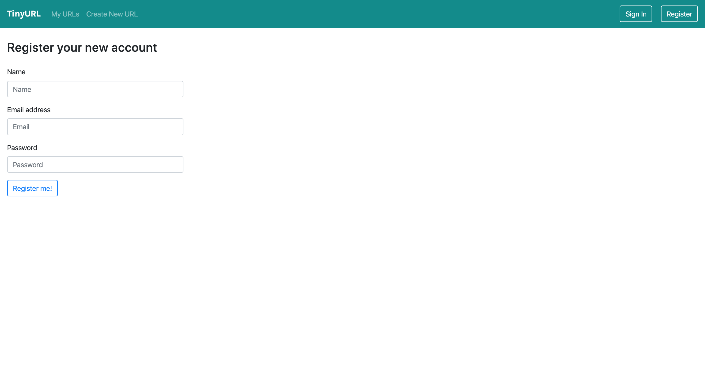
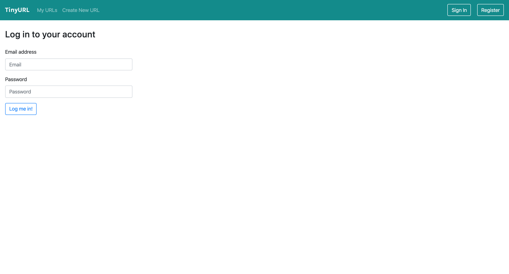
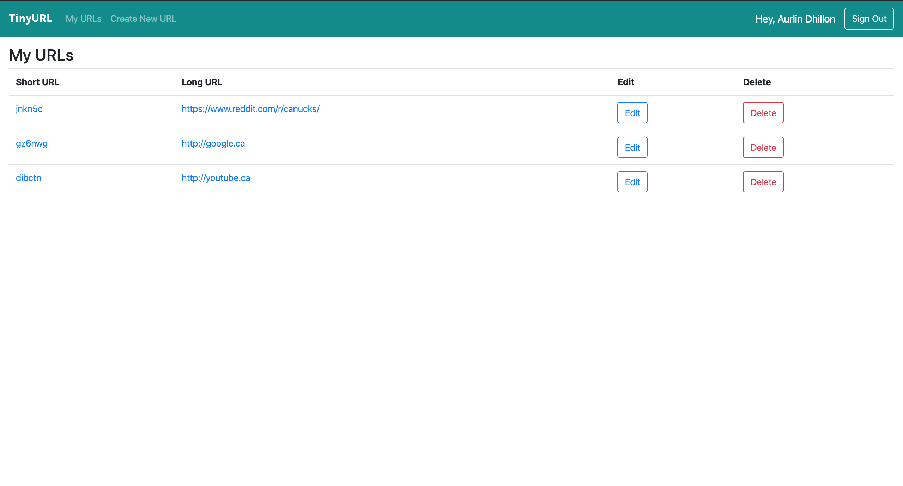
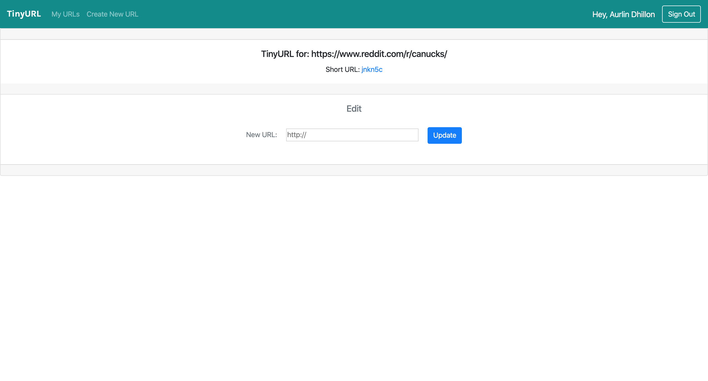

# tinyURL Project

tinyURL is a full stack web application built with Node and Express that allows users to shorten long URLs (à la bit.ly). Users can create an account and keep track of all their links.

## Final Product

## Dependencies

- Node.js
- Express
- EJS
- body-parser
- cookie-parser

## Getting Started

- Install all dependencies (using the `npm install` command).
- Run the development web server using the `node express_server.js` or `npm start` command.
- Go to your local browser at http://localhost:8080/urls to view the application
